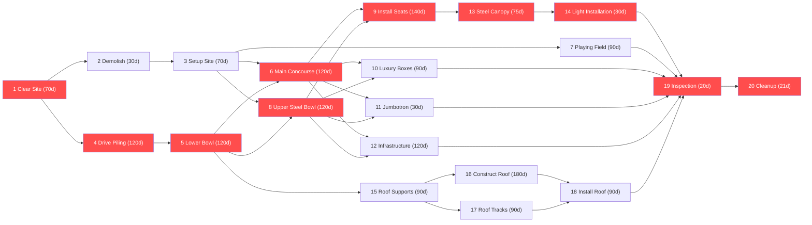

```mermaid
flowchart LR

%% ---- LEVEL 1 ----
A1["1 Clear Site (70d)"] 

%% ---- LEVEL 2 ----
A2["2 Demolish (30d)"]
A4["4 Drive Piling (120d)"]

%% ---- LEVEL 3 ----
A3["3 Setup Site (70d)"]
A5["5 Lower Bowl (120d)"]

%% ---- LEVEL 4 ----
A6["6 Main Concourse (120d)"]
A7["7 Playing Field (90d)"]
A8["8 Upper Steel Bowl (120d)"]
A15["15 Roof Supports (90d)"]

%% ---- LEVEL 5 ----
A9["9 Install Seats (140d)"]
A10["10 Luxury Boxes (90d)"]
A11["11 Jumbotron (30d)"]
A12["12 Infrastructure (120d)"]
A16["16 Construct Roof (180d)"]
A17["17 Roof Tracks (90d)"]

%% ---- LEVEL 6 ----
A13["13 Steel Canopy (75d)"]
A18["18 Install Roof (90d)"]

%% ---- LEVEL 7 ----
A14["14 Light Installation (30d)"]

%% ---- LEVEL 8 ----
A19["19 Inspection (20d)"]
A20["20 Cleanup (21d)"]

%% ---- Dependencies ----
A1 --> A2
A1 --> A4
A2 --> A3
A4 --> A5
A3 --> A6
A3 --> A8
A3 --> A7
A5 --> A6
A5 --> A8
A5 --> A15
A6 --> A9
A6 --> A10
A6 --> A11
A6 --> A12
A8 --> A9
A8 --> A10
A8 --> A11
A8 --> A12
A15 --> A16
A15 --> A17
A16 --> A18
A17 --> A18
A9 --> A13
A13 --> A14
A14 --> A19
A7 --> A19
A10 --> A19
A11 --> A19
A12 --> A19
A18 --> A19
A19 --> A20

%% ---- Critical Path Styling ----
style A1 fill:#ff4d4d,color:#fff
style A4 fill:#ff4d4d,color:#fff
style A5 fill:#ff4d4d,color:#fff
style A6 fill:#ff4d4d,color:#fff
style A8 fill:#ff4d4d,color:#fff
style A9 fill:#ff4d4d,color:#fff
style A13 fill:#ff4d4d,color:#fff
style A14 fill:#ff4d4d,color:#fff
style A19 fill:#ff4d4d,color:#fff
style A20 fill:#ff4d4d,color:#fff
```
# sanjana
