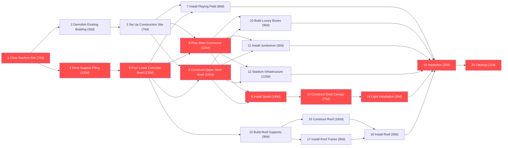

```mermaid
flowchart LR

A1["1 Clear Stadium Site (70d)"] --> A2["2 Demolish Existing Building (30d)"]
A1 --> A4["4 Drive Support Piling (120d)"]
A2 --> A3["3 Set Up Construction Site (70d)"]
A4 --> A5["5 Pour Lower Concrete Bowl (120d)"]
A3 --> A6["6 Pour Main Concourse (120d)"]
A5 --> A6
A3 --> A7["7 Install Playing Field (90d)"]
A5 --> A7
A3 --> A8["8 Construct Upper Steel Bowl (120d)"]
A5 --> A8
A6 --> A9["9 Install Seats (140d)"]
A8 --> A9
A6 --> A10["10 Build Luxury Boxes (90d)"]
A8 --> A10
A6 --> A11["11 Install Jumbotron (30d)"]
A8 --> A11
A6 --> A12["12 Stadium Infrastructure (120d)"]
A8 --> A12
A5 --> A15["15 Build Roof Supports (90d)"]
A15 --> A16["16 Construct Roof (180d)"]
A15 --> A17["17 Install Roof Tracks (90d)"]
A16 --> A18["18 Install Roof (90d)"]
A17 --> A18
A9 --> A13["13 Construct Steel Canopy (75d)"]
A13 --> A14["14 Light Installation (30d)"]
A7 --> A19["19 Inspection (20d)"]
A10 --> A19
A11 --> A19
A12 --> A19
A14 --> A19
A18 --> A19
A19 --> A20["20 Cleanup (21d)"]

%% Critical path nodes
style A1 fill:#ff4d4d,color:#fff
style A4 fill:#ff4d4d,color:#fff
style A5 fill:#ff4d4d,color:#fff
style A6 fill:#ff4d4d,color:#fff
style A8 fill:#ff4d4d,color:#fff
style A9 fill:#ff4d4d,color:#fff
style A13 fill:#ff4d4d,color:#fff
style A14 fill:#ff4d4d,color:#fff
style A19 fill:#ff4d4d,color:#fff
style A20 fill:#ff4d4d,color:#fff
```
# sanjana
