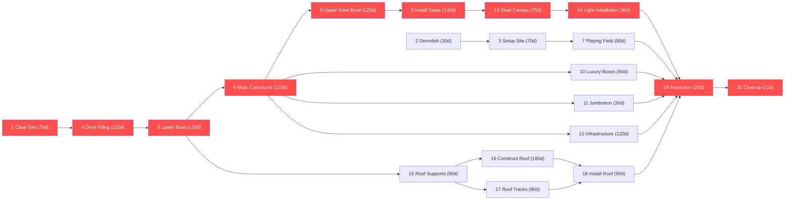

```mermaid
flowchart LR

%% ---- Critical Path ----
1["1 Clear Site (70d)"] --> 4["4 Drive Piling (120d)"] --> 5["5 Lower Bowl (120d)"] --> 6["6 Main Concourse (120d)"] --> 8["8 Upper Steel Bowl (120d)"] --> 9["9 Install Seats (140d)"] --> 13["13 Steel Canopy (75d)"] --> 14["14 Light Installation (30d)"] --> 19["19 Inspection (20d)"] --> 20["20 Cleanup (21d)"]

%% ---- Side Tasks ----
2["2 Demolish (30d)"] --> 3["3 Setup Site (70d)"] --> 7["7 Playing Field (90d)"] --> 19
6 --> 10["10 Luxury Boxes (90d)"] --> 19
6 --> 11["11 Jumbotron (30d)"] --> 19
6 --> 12["12 Infrastructure (120d)"] --> 19
5 --> 15["15 Roof Supports (90d)"] --> 16["16 Construct Roof (180d)"] --> 18["18 Install Roof (90d)"] --> 19
15 --> 17["17 Roof Tracks (90d)"] --> 18

%% ---- Highlight Critical Path ----
style 1 fill:#ff4d4d,color:#fff
style 4 fill:#ff4d4d,color:#fff
style 5 fill:#ff4d4d,color:#fff
style 6 fill:#ff4d4d,color:#fff
style 8 fill:#ff4d4d,color:#fff
style 9 fill:#ff4d4d,color:#fff
style 13 fill:#ff4d4d,color:#fff
style 14 fill:#ff4d4d,color:#fff
style 19 fill:#ff4d4d,color:#fff
style 20 fill:#ff4d4d,color:#fff
```

# sanjana
