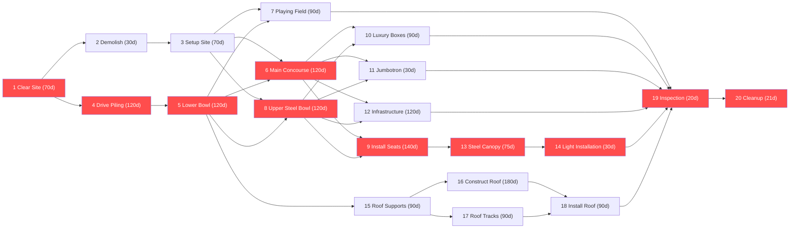

```mermaid
flowchart LR

%% ---- Nodes ----
1["1 Clear Site (70d)"]
2["2 Demolish (30d)"]
3["3 Setup Site (70d)"]
4["4 Drive Piling (120d)"]
5["5 Lower Bowl (120d)"]
6["6 Main Concourse (120d)"]
7["7 Playing Field (90d)"]
8["8 Upper Steel Bowl (120d)"]
9["9 Install Seats (140d)"]
10["10 Luxury Boxes (90d)"]
11["11 Jumbotron (30d)"]
12["12 Infrastructure (120d)"]
13["13 Steel Canopy (75d)"]
14["14 Light Installation (30d)"]
15["15 Roof Supports (90d)"]
16["16 Construct Roof (180d)"]
17["17 Roof Tracks (90d)"]
18["18 Install Roof (90d)"]
19["19 Inspection (20d)"]
20["20 Cleanup (21d)"]

%% ---- Dependencies ----
1 --> 2
1 --> 4
2 --> 3
4 --> 5
3 --> 6
5 --> 6
3 --> 7
5 --> 7
3 --> 8
5 --> 8
6 --> 9
8 --> 9
6 --> 10
8 --> 10
6 --> 11
8 --> 11
6 --> 12
8 --> 12
5 --> 15
15 --> 16
15 --> 17
16 --> 18
17 --> 18
9 --> 13
13 --> 14
7 --> 19
10 --> 19
11 --> 19
12 --> 19
14 --> 19
18 --> 19
19 --> 20

%% ---- Highlight Critical Path ----
style 1 fill:#ff4d4d,color:#fff
style 4 fill:#ff4d4d,color:#fff
style 5 fill:#ff4d4d,color:#fff
style 6 fill:#ff4d4d,color:#fff
style 8 fill:#ff4d4d,color:#fff
style 9 fill:#ff4d4d,color:#fff
style 13 fill:#ff4d4d,color:#fff
style 14 fill:#ff4d4d,color:#fff
style 19 fill:#ff4d4d,color:#fff
style 20 fill:#ff4d4d,color:#fff
```

# sanjana
